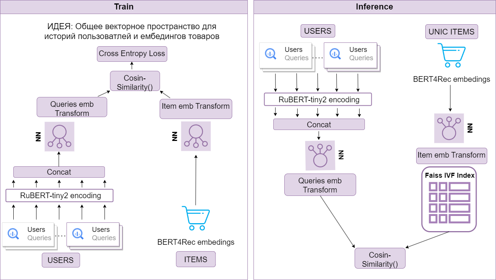

### Модель для рекоммендаций товаров на основе истории поисковых запросов пользователей

#### 1. Архитектура модели:
Модель Two Tower Encoder, который кодирует ембединги запросов и ембединги bert4rec в пространство с одной размерностью и минимизирует расстояние между семплами.

***Процесс обучения и метрики есть в ноутбуках.***

##### Схема обучения и инференса:


***Текстовое описание обучения:***
1) Загружаются данные о покупках пользователях и их запросах из Greenplum за выбранный период, а также nm_embedings bert4rec для даты ближайщей к выбранной 
2) Данные очищаются от nmid, купленных после поиска их по nmid, queries очищаются от чисто цифр, артикулов, ссылок
3) Отбираются nmid для обучения (по умолчанию 100_000 nmid), которые встречались не менее 50 раз
4) Истории обрезаются до 5 последних
5) Истории предварительно кодируются rubert-tiny2 на gpu и конкатенируются в один вектор (1560, для 5 историй). Если историй меньше 5, они дозаполняются закодированным вектором "[PAD]"
7) Ембединги товаров и закодированные истории енкодятся моделью Two Tower на gpu
8) Минимизируется косинусное расстояние между векторами по батчу

Пример запуска:
```bash
python3 -m src.models.train
```

***Текстовое описание инференса:***
1) Загружаются данные о 10 последних историях поиска пользователей из Greenplum за выбранный период, а также nm_embedings bert4rec для даты ближайщей к выбранной 
2) Выбираются пользователи и их истории, для которых нужны рекоммендации, queries очищаются от чисто цифр, артикулов, ссылок
3) Все эмбединги из nm_embedings кодируются с помощью башни предварительно обученной модели model.embedding_network_i и на основе этих ембедингов строится faiss индекс
4) Истории обрезаются до 5 последних
5) Истории предварительно кодируются rubert-tiny2 на gpu и конкатенируются в один вектор (1560, для 5 историй). Если историй меньше 5, они дозаполняются закодированным вектором "[PAD]"
7) Вектора историй кодируются с помощью башни model.embedding_network_q
8) Проходимся по датасету и рекомендуем ближайшие по faiss nmid товаров (по умолчанию 200)
9) Записываем рекомендации в файл

Пример запуска:
```bash
python3 -m src.models.predict
```


#### 2. Структура репозитория:
```
├── data               <- данные:
│   ├── external       <- из внешних источников (nm_embedings, users_id_predict)
│   ├── interim        <- промежуточные (отфильтрованные)
│   └── raw            <- cырые, только загруженные
|
├── scripts                             <- sql-запросы
│   ├── orders_with_queries_train.sql   <- забирает все агрегированные корзины пользователей и истории запросов перед ними за указанный период
│   └── user_queries.sql                <- забирает последние 10 запросов пользователей отфильтрованные от чисто цифр (артикулы) за указанный период
|
├── models                <- для обученных моделей, предиктов и метрик
│   └──predictions        <- папка с датасетом предсказанных рекоммендаций
|
├── requirements.txt   <- Зависимости
├── src                <- Python скрипты для:
│   ├── data              <- Работы с данными
│   │   ├── __init__.py        
│   │   ├── data_filtering.py   <- функции для фильтрации данных
│   │   ├── data_load.py        <- функции для загрузки данных, как для обучения, так и для инференса
│   │   └──Dataset.py           <- класс датасета для обучения
│   │ 
│   ├── models            <- Обучения модели и предсказания
│   │   ├── __init__.py        
│   │   ├── MultiMarginLoss.py   <- класс ошибки для функции потерь
│   │   ├── TwoTowerModel.py     <- класс модели
│   │   ├── train.py             <- скрипт для обучения модели
│   │   └── predict.py           <- скрипт для предсказания рекомендаций для выбранных пользователей за выбранный период
│   │
│   └── utils             <- Служебные классы
│       ├── __init__.py        
│       ├── config.py            <- конфиги для кредов и переменных для обучения и предикта
│       ├── connection.py        <- подключение к Greenplum и S3
│       ├── encode_queries.py    <- функции для кодирование текстовых запросов в ембединги 
│       ├── faiss_index.py       <- скрипт для обучения faiss индекса
│       ├── get_embeddings.py    <- функции для кодирования ембедингов с помощью обученной модели
│       ├── logger.py            <- инструмент логгирования
│       └── metrics.py           <- функции для расчёта метрик
|
├── docs               <- для всего, что касается доки
|
└── notebooks          <- ноутбуки. Описания внутри
|
└── artifacts          <- Артефакты, не связанные с данными (логи ...)
```
